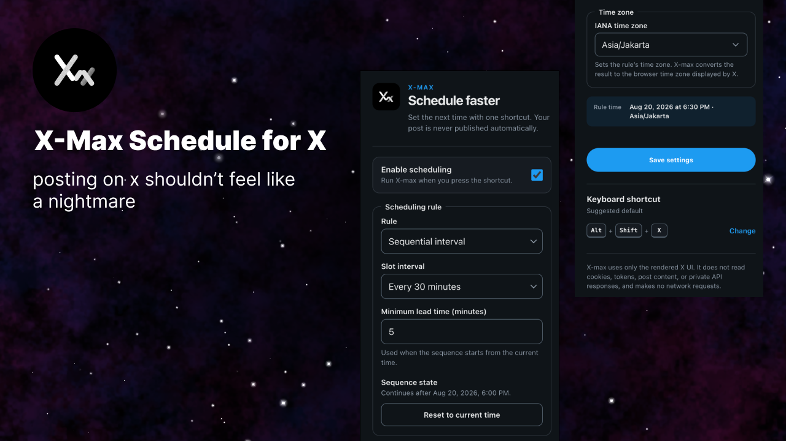

<p align="center">
  
</p>

<h1 align="center">X-max Schedule Time</h1>

<p align="center">
  Set the schedule time for an X post with one keyboard shortcut.<br>
  X-max uses X's native schedule controls and never publishes the post automatically.
</p>

<p align="center">
  <a href="https://github.com/blepotan/x-max/stargazers"><picture><source media="(prefers-color-scheme: dark)" srcset="https://shieldcn.dev/github/stars/blepotan/x-max.svg?variant=branded&amp;mode=dark"></picture></a>
  <a href="LICENSE"><picture><source media="(prefers-color-scheme: dark)" srcset="https://shieldcn.dev/github/license/blepotan/x-max.svg?mode=dark"></picture></a>
  <a href="https://github.com/blepotan/x-max/graphs/contributors"><picture><source media="(prefers-color-scheme: dark)" srcset="https://shieldcn.dev/github/contributors/blepotan/x-max.svg?mode=dark"></picture></a>
  <a href="https://github.com/blepotan/x-max/commits/main"><picture><source media="(prefers-color-scheme: dark)" srcset="https://shieldcn.dev/github/last-commit/blepotan/x-max/main.svg?variant=secondary&amp;mode=dark"></picture></a>
  <a href="https://chromewebstore.google.com/detail/x-max-schedule-time/lpnbojhlldmiibaaoeijacaejadlmfbb"></a>
</p>

## Demo

<video src="docs/assets/schedule.mp4" controls muted width="720">
  Your browser cannot show this video. Use the demo link below.
</video>

[Open the demo video](docs/assets/schedule.mp4)

## Main functions

- Use a fixed delay from the current time.
- Use a sequential interval for a series of posts.
- Reset the sequence to the current time.
- Convert the rule time zone to the browser time zone that X uses.
- Open and operate the X schedule dialog in the background.
- Show the rule time and the converted X time.
- Configure the action with a Chrome keyboard shortcut.

## Install the extension

Install from the [Chrome Web Store](https://chromewebstore.google.com/detail/x-max-schedule-time/lpnbojhlldmiibaaoeijacaejadlmfbb), or load it manually:

1. Download or clone this repository.
2. Open `chrome://extensions` in Google Chrome.
3. Set **Developer mode** to on.
4. Click **Load unpacked**.
5. Select the repository directory.
6. Refresh each open X tab.

## Set the keyboard shortcut

1. Open `chrome://extensions/shortcuts`.
2. Find **X-max Schedule Time**.
3. Set a shortcut for **Set the next X post schedule time**.

The suggested shortcut is `Alt+Shift+X`.

## Configure a rule

Click the X-max icon in the Chrome toolbar. Select one scheduling rule.

### Fixed delay

Set the number of minutes after the current time. For example, set `60` to schedule the post one hour from now.

### Sequential interval

Set the interval between posts. X-max stores the time of the last schedule that it applied. The next shortcut adds one interval to that time.

The minimum lead time applies when the sequence starts from the current time.

Use **Reset to current time** to delete the stored sequence time. The next shortcut starts a new sequence from the current time.

## Time zones

The rule time zone controls the schedule calculation. X cannot change its time zone in the schedule dialog.

X-max converts the result to the browser time zone. It then writes the converted date and time to X.

The preview shows two values when the zones are different:

- **Rule time:** The time in the configured rule zone.
- **X time:** The equivalent time in the browser zone.

Use `local` to use the browser time zone for both values.

## Use X-max

1. Open an X post composer.
2. Write the post.
3. Press the X-max shortcut.
4. Wait for the confirmation notification.
5. Review the scheduled time in the composer.

## Privacy

Read the full [Privacy Policy](PRIVACY.md).

X-max operates only on the rendered X interface. It does not use private X API endpoints.

X-max does not read these items:

- Cookies
- Authentication tokens
- Post text
- Private API responses

X-max does not make network requests.

## Development

The extension has no runtime dependencies. Use Bun 1.3.14 or a compatible later version for development.

Run the tests:

```sh
bun test
```

Check the JavaScript syntax:

```sh
bun run check
```

Build the Chrome Web Store package:

```sh
bun run build
```

The command creates the Chrome Web Store release archive at `dist/x-max-v<version>.zip`.

## Release information

See [CHANGELOG.md](CHANGELOG.md) for the changes in each release.

## License

This project uses the MIT License. See [LICENSE](LICENSE).
